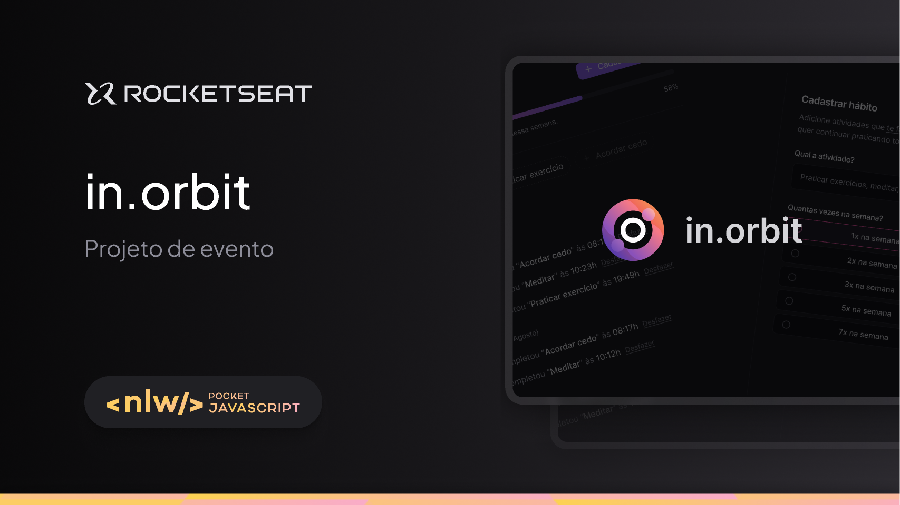

<h1 align="center">
  in.orbit
</h1>

<p align="center">
  
  
  
</p>

<p>
  
</p>

## 💻 Sobre

Este é o repositório do **in.orbit**, que é um sistema de planejamento de viagens, onde é possível montar planos de viagens com amigos. É possível cadastrar atividades, adicionar links úteis sobre a viagem, entre outras funcionalidades.

Essa aplicação foi desenvolvida durante o evento **Next Level Week Journey** da [Rocketseat](https://www.rocketseat.com.br/) utilizando principalmente tecnologias como `Node`, `TypeScript`, `Fastify` e `React`.


<!--
## 🔗 Deploy
O deploy da aplicação pode ser acessada através da seguinte URL base:
-->

## ⚙ Instalação

### 📝 Requisitos

Antes de baixar o projeto é necessário ter as seguintes ferramentas já instaladas:

* [Git](https://git-scm.com)
* [Node.js](https://nodejs.org/en/)
* [npm](https://www.npmjs.com/), [pnpm](https://pnpm.io/pt/) ou [yarn](https://yarnpkg.com/)

Utilize uma ferramenta como [Postman](https://www.postman.com/), ou outra similar, para testar as rotas da aplicação sem o frontend.

### Configuração

Passo a passo para clonar e executar a aplicação na sua máquina:

```bash
# Clone este repositório
$ git clone https://github.com/campagnuci/in.orbit

# Acesse a pasta do projeto no terminal
$ cd in.orbit

# Acesse a pasta do backend:
$ cd server

# Instale as dependências
$ npm install

# Crie o arquivo '.env' e preencha as variáveis conforme o arquivo '.env.example'
$ cp .env.example .env

# Suba o Banco de Dados via Docker
$ docker-compose up -d

# Execute as migrations para criar as tabelas necessários no banco
$ npx drizzle-kit migrate

# Execute o seed para popular o banco de dados
$ npm run seed

# Execute a aplicação em modo de desenvolvimento
$ npm run dev

# A aplicação inciará na porta que você configurou no arquivo '.env'
# Volte para o diretório anterior e acessa a pasta do frontend
$ cd ../web

# Instale as dependências
$ npm install

# Execute a aplicação em modo de desenvolvimento
$ npm run dev

# A aplicação inciará na porta padrão do vite, 5173
```

### Documentação

Após o servidor backend estar rodando, é possível acessar ele através da rota `/docs` na aplicação. Caso tenha utilizado a porta padrão, `3333`, o endereço será: `http://localhost:3333/docs`

## 🛠 Tecnologias

As seguintes libs foram usadas na construção do projeto:

### Linting
- **[BiomeJS](https://biomejs.dev/)**

### Backend
- **[DayJS](https://day.js.org/)**
- **[Drizzle ORM](https://orm.drizzle.team/)**
- **[Fastify](https://fastify.dev/)**
- **[tsx](https://tsx.is/)**
- **[TypeScript](https://www.typescriptlang.org/)**
- **[Zod](https://zod.dev/)**

### Frontend
- **[LucideReact](https://lucide.dev/guide/packages/lucide-react)**
- **[Radix-ui](https://www.radix-ui.com/primitives)**
- **[React](https://react.dev/)**
- **[ReactHookForm](https://www.react-hook-form.com/)**
- **[ReactQuery](https://tanstack.com/query/latest)**
- **[TailwindCSS](https://tailwindcss.com/)**
- **[Tailwind-Variants](https://www.tailwind-variants.org/)**
- **[Tailwind-Merge](https://www.tailwind-variants.org/)**

> Para mais detalhes das dependências gerais da aplicação veja os arquivos de cada componente da aplicação [backend](./server/package.json) e [frontend](./web/package.json)
